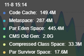
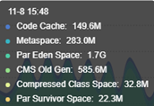
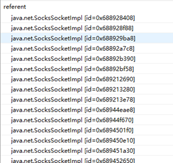
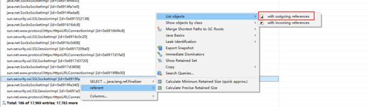
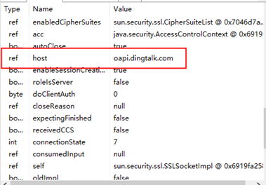
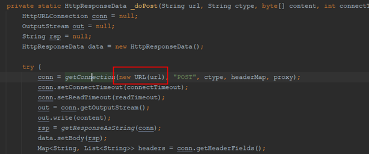

## 发现问题
线上有个系统最近频繁的爆出FullGC

## 定位问题
通过监控平台可以查看到JVM内存使用信息

{: .normal}
{: .normal}

该JVM堆分配了4G的内存, 年老代已经占用了2G. 并且在FullGC后年老代内存大量降低, 可以推断出, 大量的对象来不及在年轻代里面回收从而进入了年老代.

登上服务器执行下面的命令把当前堆的所有对象信息dump下来
```
#如果不加 -all 的话会先执行一次FullGC
jcmd ${pid} GC.heap_dump -all /tmp/heap.bin
```

然后用Eclipse Memory Analyzer (MAT)打开, 通过dominator tree可以看到, 75%的内存对象都是被 java.lang.ref.Finalizer持有了.

回顾一下 java.lang.ref.Finalizer 的知识可以知道, 当一个对象被回收时, 如果重写了java.lang.Object#finalize(), 改对象被垃圾回收器回收时会被放进java.lang.ref.Finalizer 的 queue 里面作最后的释放对象处理.

java.lang.ref.Finalizer 的 queue 是由一个偏高优先级守护线程来消费,
从而知道, 有大量的对象需要执行 finalize() 方法堆积在一起来不及消费, 从而长时间地存活在系统里面, 导致被转移到年老代.
```java
//创建线程
    ThreadGroup tg = Thread.currentThread().getThreadGroup();
    for (ThreadGroup tgn = tg;
         tgn != null;
         tg = tgn, tgn = tg.getParent());
    Thread finalizer = new FinalizerThread(tg);
    finalizer.setPriority(Thread.MAX_PRIORITY - 2);//偏高优先级, 默认是5
    finalizer.setDaemon(true);//守护线程
    finalizer.start();


    private static class FinalizerThread extends Thread {
        private volatile boolean running;
        FinalizerThread(ThreadGroup g) {
            super(g, "Finalizer");
        }
        public void run() {
            // in case of recursive call to run()
            if (running)
                return;

            // Finalizer thread starts before System.initializeSystemClass
            // is called.  Wait until JavaLangAccess is available
            while (!VM.isBooted()) {
                // delay until VM completes initialization
                try {
                    VM.awaitBooted();
                } catch (InterruptedException x) {
                    // ignore and continue
                }
            }
            final JavaLangAccess jla = SharedSecrets.getJavaLangAccess();
            running = true;
            //循环消费队列数据
            for (;;) {
                try {
                    Finalizer f = (Finalizer)queue.remove();
                    f.runFinalizer(jla);
                } catch (InterruptedException x) {
                    // ignore and continue
                }
            }
        }
    }
```
## 是什么对象被长期持有?
究竟是什么东西被大量创建然后又被大量地等待执行 finalize() ?
查看 Finalizer 类可以知道字段 referent 就是需要执行finalize()方法的对象.

通过MAT 的OQL查询出 referent 有哪些对象
```
SELECT referent FROM java.lang.ref.Finalizer
```
{: .normal}

然后把结果导出再统计一下类, 发现有一半的对象都是被SSLSocketImpl持有, 而SSLSocketImpl又持有了SSLSessionImpl

sun.security.ssl.SSLSocketImpl 总数: 4833

sun.security.ssl.SSLSessionImpl 总数: 5064

再回到MAT, 通过outgoing查看这些对象持有了什么对象, 可以看到, 大部分host都是"oapi.dingtalk.com"
{: .normal}
{: .normal}

## 根本原因
通过翻查我们自身业务代码, 有一个业务场景需要大量调用钉钉SDK 二方包接口发送钉钉通知. 这是一个HTTPS的接口, 每调用一次会new URL() 去请求. 导致大量通知时会有大量的连接创建, 大量的连接等待释放.

{: .normal}

URL -> SSLSocketImpl 调用链
{: .normal}

## 解决方案
1. 垃圾回收切换到G1, G1会有一个Mix GC阶段, 会把一部分年老代的对象回收. 这是最快的解决方案, 但也只是缓解
2. 根本解决方法1, 联系钉钉团队提供, 这方法依赖其他团队进度, 对我们自身系统影响较大
3. 根本解决方法2, 采用连接池方式请求, 自己写Http请求
