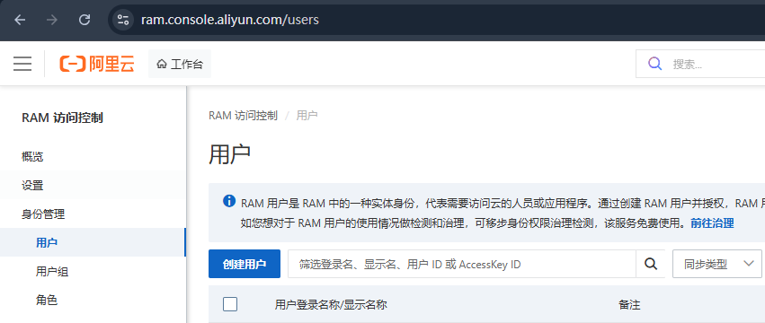
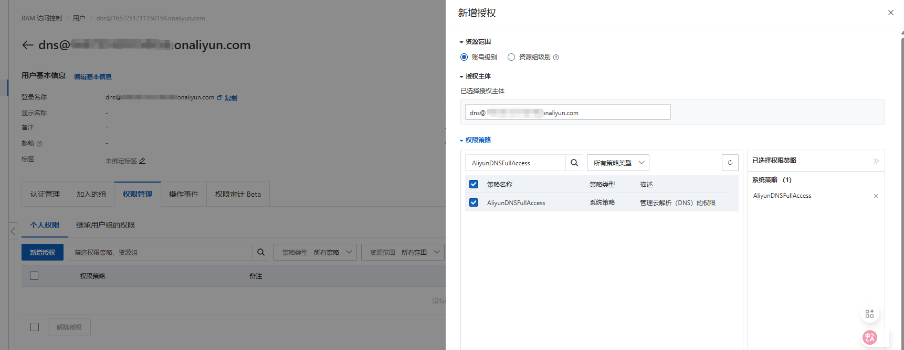
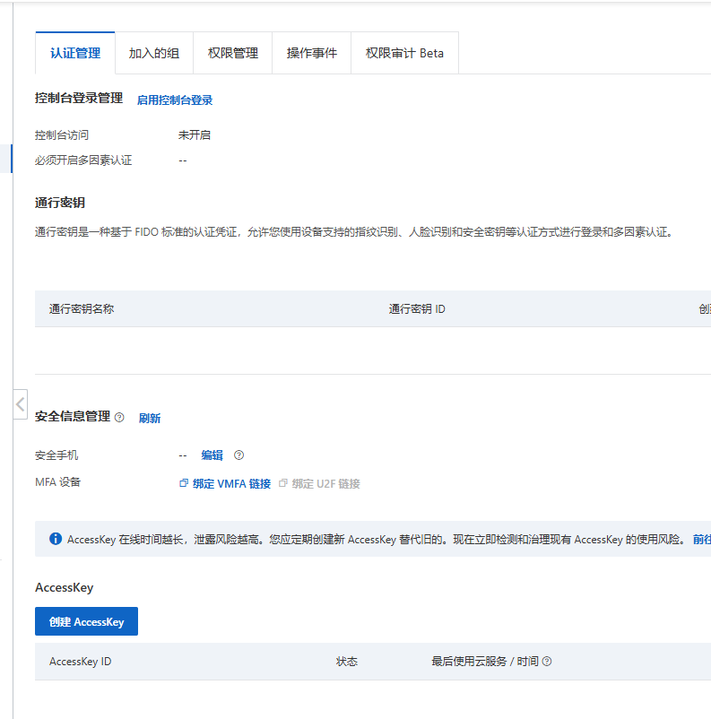

## 原理
使用 DNS-01 验证方式证明域名所有权. 不同 DNS 服务商的 API 不同, 需要安装对应的 webhook. cert-manager 会自动管理证书生命周期并在到期前发起续签,续签过程中通过该 webhook 调用阿里云 API 创建/删除域名验证用的 TXT 记录

## 步骤
1. 让证书到期能自动续期
2. 让Let's Encrypt能检验域名拥有权

## 证书自动续期
在 Kubernetes 里, 可以使用 [cert-manager](https://cert-manager.io/) 管理证书以及证书的自动续期.

由于cert-manager 内置的DNS供应商不支持阿里云DNS, 详细请看 [Supported DNS01 providers](https://cert-manager.io/docs/configuration/acme/dns01/#supported-dns01-providers).幸好cert-manager 的 Webhook 扩展了 cert-manager 的 DNS-01 验证所支持的 DNS 提供商, 已经有许多第三方实现, 详细列表和用法请参见 [Webhook](https://cert-manager.io/docs/configuration/acme/dns01/#webhook)

我使用的是 https://github.com/crazygit/cert-manager-alidns-webhook

https://github.com/DEVmachine-fr/cert-manager-alidns-webhook 这个Webhook 是某公司维护的, 相对正规且活跃, 但我把它部署在cert-manager 所在的namespace时无法启动Pod, 而在default 下却又可以, 无法找到原因就放弃了

https://github.com/pragkent/alidns-webhook 很久没维护了, 新的K8S版本不再支持

##  安装Webhook
### 创建AccessKey
第一步先去阿里云申请AK SK, 按照下图步骤创建用户+分配权限+创建AccessKey






### K8S创建Secret
将上述AK和SK替换到下面命令并执行

```bash
kubectl create secret generic alidns-secret --from-literal="access-key=yourtoken" --from-literal="secret-key=yoursecretkey" -n cert-manager
```

### 部署 Webhook
```bash
helm install cert-manager-alidns-webhook \
oci://ghcr.io/crazygit/charts/cert-manager-alidns-webhook \
-n cert-manager \
--set aliyunAuth.existingSecret=alidns-secret \
--set image.repository=crazygit/cert-manager-alidns-webhook
```

### 创建ClusterIssuer
也就是创建根CA证书

```yaml
apiVersion: cert-manager.io/v1
kind: ClusterIssuer
metadata:
  name: letsencrypt-prod
spec:
  acme:
    # Change to your letsencrypt email
    email: repo@demo.com
    server: https://acme-v02.api.letsencrypt.org/directory
    privateKeySecretRef:
      name: letsencrypt-prod-account-key
    solvers:
      - dns01:
          webhook:
            groupName: alidns.crazygit.github.io
            solverName: alidns
```

### 申请SSL证书
```yaml
apiVersion: cert-manager.io/v1
kind: Certificate
metadata:
  name: demo-com-tls
  # 按照自己需要替换
  namespace: traefik
spec:
  secretName: demo-com-tls
  dnsNames:
    - "*.demo.com"
    - "*.internal.demo.com"
  issuerRef:
    # 值必须是上面的 ClusterIssuer 的 name
    name: letsencrypt-prod
    kind: ClusterIssuer
```
执行完之后```kubectl get Certificate -n traefik``` demo-com-tls的状态 READY 为 True 则代表已经生成好证书

```kubectl get secrets -n traefik``` 能看到生成的 demo-com-tls, 里面的是对应的是 SSL 的公钥和私钥

### Traefik 使用SSL证书
```yaml
apiVersion: traefik.io/v1alpha1
kind: IngressRoute
metadata:
  name: home-route-https
  namespace: traefik
spec:
  entryPoints:
    - websecure
  routes:
    - match: Host(`home.demo.com`)
      kind: Rule
      services:
        - name: home-index
          namespace: default
          port: 80
  tls:
    # 值为前面的 Certificate name
    secretName: demo-com-tls
```
